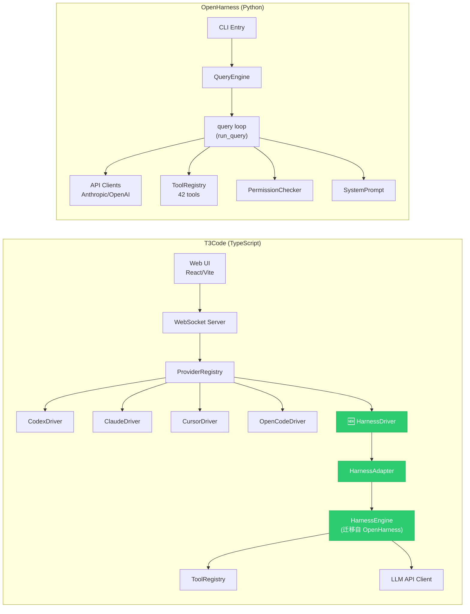
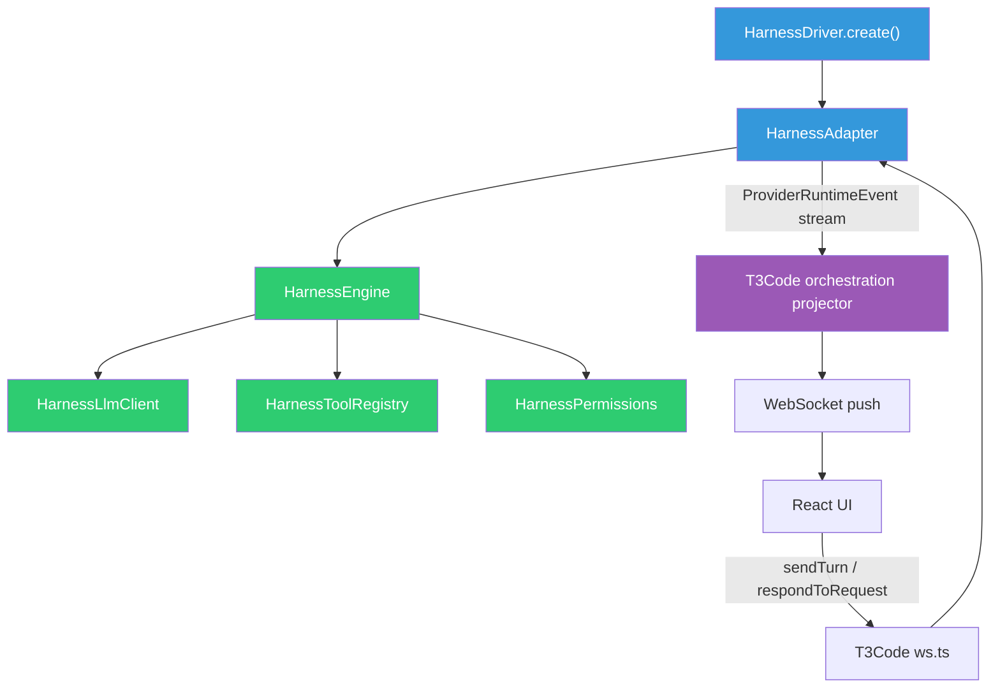

# OpenHarness → T3Code 原生迁移方案

> **目标**：将 OpenHarness（Python）的 Agent 大脑——编排循环、工具系统、提示词引擎——用 TypeScript 重写并原生嵌入 T3Code 的 Provider 架构，使 T3Code 成为一个**完全自主**的 AI 编程助手，不再依赖 Codex / Claude 等外部 Agent 运行时。

---

## 一、两大项目架构对比



### 核心差异

| 维度 | T3Code | OpenHarness |
|:---|:---|:---|
| **语言** | TypeScript (Effect TS) | Python (asyncio) |
| **角色** | Agent 宿主 + UI | Agent 引擎 + CLI |
| **编排循环** | ❌ 无 (委托给外部 Provider) | ✅ `run_query()` 完整 ReAct 循环 |
| **工具系统** | ❌ 无 (由 Provider 提供) | ✅ 42 个内置工具 |
| **LLM 客户端** | ❌ 无 (由 Provider 处理) | ✅ Anthropic + OpenAI 兼容 |
| **提示词系统** | ❌ 无 | ✅ 完整 system prompt 组装 |
| **权限系统** | 仅 UI 审批 | ✅ PermissionChecker + modes |
| **会话持久化** | ✅ SQLite | ❌ 内存/文件 |
| **多用户** | ✅ 天然支持 | ❌ 单用户 CLI |

---

## 二、迁移总体策略

> [!IMPORTANT]
> **原则**：不做桥接，不做子进程调用。将 OpenHarness 的核心逻辑用 TypeScript 重写，原生嵌入 T3Code 的 Effect TS 服务体系。

### 需要迁移的 OpenHarness 模块

| OpenHarness 模块 | 文件 | 迁移优先级 | 目标位置 (T3Code) |
|:---|:---|:---|:---|
| **Agent 编排循环** | `engine/query.py` + `engine/query_engine.py` | 🔴 P0 | `apps/server/src/provider/Layers/HarnessEngine.ts` |
| **LLM API 客户端** | `api/client.py` + `api/openai_client.py` | 🔴 P0 | `apps/server/src/provider/Layers/HarnessLlmClient.ts` |
| **消息模型** | `engine/messages.py` | 🔴 P0 | `packages/contracts/src/HarnessMessage.ts` |
| **流事件模型** | `engine/stream_events.py` | 🔴 P0 | 复用 `ProviderRuntimeEvent` |
| **工具基类 + 注册** | `tools/base.py` + `tools/__init__.py` | 🔴 P0 | `apps/server/src/provider/HarnessTools/` |
| **核心工具 (bash, file_*, grep, glob)** | `tools/bash_tool.py` 等 | 🟡 P1 | `apps/server/src/provider/HarnessTools/` |
| **高级工具 (agent, mcp, web_*)** | `tools/agent_tool.py` 等 | 🟢 P2 | `apps/server/src/provider/HarnessTools/` |
| **权限系统** | `permissions/checker.py` | 🟡 P1 | `apps/server/src/provider/Layers/HarnessPermissions.ts` |
| **System Prompt** | `prompts/system_prompt.py` | 🟡 P1 | `apps/server/src/provider/HarnessSystemPrompt.ts` |
| **Provider 注册表** | `api/registry.py` | 🟡 P1 | `apps/server/src/provider/HarnessProviderRegistry.ts` |
| **上下文压缩** | `services/compact.py` | 🟢 P2 | `apps/server/src/provider/Layers/HarnessCompaction.ts` |
| **Skills/Memory/Hooks** | `skills/`, `memory/`, `hooks/` | 🟢 P2 | 后续阶段 |
| **Coordinator/Swarm** | `coordinator/`, `swarm/` | 🔵 P3 | 后续阶段 |

### 不需要迁移的模块

| 模块 | 原因 |
|:---|:---|
| `cli.py`, `ui/`, `themes/`, `vim/`, `voice/` | T3Code 已有更好的 Web UI |
| `config/`, `state/` | T3Code 使用自己的 ServerSettings + SQLite |
| `auth/` (external OAuth) | T3Code 有完善的 auth 层 |
| `bridge/` | 我们做的就是替代桥接 |

---

## 三、分阶段实施计划

### Phase 0: 基础设施准备 (1-2 天)

```
apps/server/src/provider/
├── Drivers/
│   └── HarnessDriver.ts          ← 新增：ProviderDriver 实现
├── Layers/
│   └── HarnessAdapter.ts         ← 新增：ProviderAdapterShape 实现
│   └── HarnessEngine.ts          ← 新增：Agent 编排循环核心
│   └── HarnessLlmClient.ts       ← 新增：LLM API 调用
├── Services/
│   └── HarnessAdapter.ts         ← 新增：Effect Context.Tag
├── HarnessTools/                  ← 新增目录
│   ├── ToolBase.ts
│   ├── ToolRegistry.ts
│   └── ...
├── HarnessSystemPrompt.ts         ← 新增
├── HarnessProviderRegistry.ts     ← 新增
└── builtInDrivers.ts             ← 修改：注册 HarnessDriver
```

**具体任务：**

1. **定义 `HarnessSettings` schema** (`packages/contracts`)
```typescript
// 用户可配置的设置
export const HarnessSettings = Schema.Struct({
  enabled: Schema.optionalWith(Schema.Boolean, { default: () => true }),
  model: Schema.optionalWith(Schema.String, { default: () => "gemini-2.5-flash" }),
  apiKey: Schema.optionalWith(Schema.String, { default: () => "" }),
  baseUrl: Schema.optionalWith(Schema.String, { default: () => "" }),
  maxTokens: Schema.optionalWith(Schema.Number, { default: () => 16384 }),
  maxTurns: Schema.optionalWith(Schema.Number, { default: () => 200 }),
  permissionMode: Schema.optionalWith(
    Schema.Literal("auto", "confirm", "deny"),
    { default: () => "confirm" as const }
  ),
});
```

2. **创建空壳 `HarnessDriver`**：实现 `ProviderDriver` 接口，先返回 pending snapshot
3. **注册到 `builtInDrivers.ts`**

---

### Phase 1: 核心 Agent 引擎 (3-5 天)

> [!IMPORTANT]
> 这是整个迁移的核心。将 OpenHarness 的 `run_query()` 编排循环用 TypeScript 重写。

#### 1.1 消息模型 (`HarnessMessage.ts`)

将 OpenHarness 的 `ConversationMessage` / `ContentBlock` 翻译为 TypeScript：

```typescript
// 对应 OpenHarness engine/messages.py
type ContentBlock = TextBlock | ImageBlock | ToolUseBlock | ToolResultBlock;

interface HarnessMessage {
  role: "user" | "assistant";
  content: ContentBlock[];
}
```

#### 1.2 LLM 客户端 (`HarnessLlmClient.ts`)

翻译 OpenHarness 的 `OpenAICompatibleClient`，支持任意 OpenAI 兼容端点：

```typescript
// 对应 OpenHarness api/openai_client.py
// 关键：支持 streaming、tool_calls 解析、retry、thinking model
interface HarnessLlmClient {
  streamMessage(request: LlmRequest): Stream<LlmStreamEvent>;
}
```

> [!TIP]
> OpenHarness 的 `OpenAICompatibleClient` 已经做了非常好的 OpenAI 兼容层（包括 reasoning_content、think block stripping 等），是宝贵的参考。

#### 1.3 Agent 编排循环 (`HarnessEngine.ts`)

将 `engine/query.py` 的 `run_query()` 翻译为 Effect Stream：

```typescript
// 对应 OpenHarness engine/query.py::run_query()
function runHarnessQuery(context: HarnessQueryContext): Stream<ProviderRuntimeEvent> {
  // while (turnCount < maxTurns):
  //   1. auto-compact check
  //   2. call LLM with messages + tool schemas
  //   3. stream text deltas → emit content.delta events
  //   4. if tool_calls in response:
  //      a. emit item.started for each tool
  //      b. check permissions
  //      c. execute tools
  //      d. emit item.completed for each tool
  //      e. append tool results to messages
  //      f. continue loop
  //   5. else: emit turn.completed, return
}
```

**关键映射**：OpenHarness `StreamEvent` → T3Code `ProviderRuntimeEvent`

| OpenHarness StreamEvent | T3Code ProviderRuntimeEvent.type |
|:---|:---|
| `AssistantTextDelta` | `content.delta` (streamKind: "assistant_text") |
| `AssistantTurnComplete` | `turn.completed` |
| `ToolExecutionStarted` | `item.started` (itemType: 匹配工具类型) |
| `ToolExecutionCompleted` | `item.completed` |
| `ErrorEvent` | `runtime.error` |
| `StatusEvent` | `session.state.changed` |
| `CompactProgressEvent` | `thread.state.changed` (state: "compacted") |

#### 1.4 HarnessAdapter (`HarnessAdapter.ts`)

实现 `ProviderAdapterShape`，将 Engine 包装为 T3Code 可消费的接口：

```typescript
// 实现 ProviderAdapterShape<ProviderAdapterError>
{
  startSession: (input) => {
    // 1. 创建 HarnessEngine 实例
    // 2. 创建 HarnessLlmClient（使用 settings 中的 model/apiKey/baseUrl）
    // 3. 创建 ToolRegistry
    // 4. 创建 PermissionChecker
    // 5. 构建 SystemPrompt
    // 6. 启动 event stream pump
    // 7. 返回 ProviderSession
  },

  sendTurn: (input) => {
    // 1. 构造 user message
    // 2. 调用 engine.submitMessage()
    // 3. 将 StreamEvent 流转换为 ProviderRuntimeEvent 流
    // 4. 通过 Queue 推送到 streamEvents
  },

  respondToRequest: (threadId, requestId, decision) => {
    // 将审批决定传递给 PermissionChecker 的 deferred
  },

  interruptTurn: (threadId) => {
    // 中断当前 query loop
  },
}
```

---

### Phase 2: 工具系统 (3-5 天)

#### 2.1 工具基类

```typescript
// 对应 OpenHarness tools/base.py
interface HarnessTool<TInput> {
  name: string;
  description: string;
  inputSchema: Schema.Schema<TInput>;
  execute(input: TInput, context: ToolContext): Effect<ToolResult>;
  isReadOnly(input: TInput): boolean;
  toApiSchema(): OpenAIFunctionSchema;
}
```

#### 2.2 工具迁移优先级

**P0 必备工具（实现 MVP）**：

| 工具 | OpenHarness 源 | 说明 |
|:---|:---|:---|
| `bash` | `bash_tool.py` (219行) | 命令执行，含超时、interactive检测 |
| `read_file` | `file_read_tool.py` | 文件读取 |
| `write_file` | `file_write_tool.py` | 文件写入 |
| `file_edit` | `file_edit_tool.py` | 文件编辑（diff-based） |
| `glob` | `glob_tool.py` | 文件搜索 |
| `grep` | `grep_tool.py` | 内容搜索 |

**P1 增强工具**：

| 工具 | 说明 |
|:---|:---|
| `web_search` | 网页搜索 |
| `web_fetch` | URL 内容获取 |
| `skill` | Skills 加载 |
| `notebook_edit` | Jupyter Notebook 编辑 |
| `lsp` | Language Server Protocol |
| `todo_write` | 任务/计划管理 |
| `enter/exit_plan_mode` | 计划模式切换 |

**P2 高级工具**：

| 工具 | 说明 |
|:---|:---|
| `agent` | 子 Agent 派生 |
| `send_message` | Agent 间消息传递 |
| `mcp_tool` | MCP 工具适配器 |
| `task_*` | 任务管理系列 |
| `cron_*` | 定时任务系列 |

#### 2.3 权限系统

```typescript
// 对应 OpenHarness permissions/checker.py
interface PermissionDecision {
  allowed: boolean;
  requiresConfirmation: boolean;
  reason: string;
}

// 关键：将权限请求映射为 T3Code 的 request.opened 事件
// 用户通过 UI 审批 → respondToRequest → 解除 Deferred
```

---

### Phase 3: Provider 注册表 + System Prompt (1-2 天)

#### 3.1 Provider 注册表

将 OpenHarness 的 `PROVIDERS` 列表迁移为 T3Code 内部配置，支持用户通过 UI 选择 provider：

```typescript
// 对应 OpenHarness api/registry.py
const HARNESS_PROVIDERS = [
  { name: "gemini", baseUrl: "https://generativelanguage.googleapis.com/v1beta/openai", ... },
  { name: "openai", baseUrl: "", ... },
  { name: "deepseek", baseUrl: "https://api.deepseek.com/v1", ... },
  { name: "dashscope", baseUrl: "https://dashscope.aliyuncs.com/compatible-mode/v1", ... },
  // ... 更多 provider
] as const;
```

#### 3.2 System Prompt

将 OpenHarness 的 system prompt 模板翻译到 TypeScript，并加入 T3Code 环境上下文：

```typescript
// 对应 OpenHarness prompts/system_prompt.py
function buildHarnessSystemPrompt(options: {
  cwd: string;
  customPrompt?: string;
  toolNames: string[];
}): string;
```

---

### Phase 4: 上下文压缩 + 高级特性 (2-3 天)

- **Auto-compaction**：翻译 `services/compact.py`，在 token 接近上限时自动压缩
- **Tool output offloading**：大输出写入临时文件，内联仅保留预览
- **Coordinator mode**：翻译 `coordinator/coordinator_mode.py`（多 Agent 协作）
- **Skills system**：翻译 `skills/loader.py` + `skills/bundled/`
- **Hook system**：翻译 `hooks/executor.py`

---

## 四、关键技术决策

### 4.1 Python → TypeScript 翻译策略

| Python 模式 | TypeScript 等价 |
|:---|:---|
| `asyncio` / `async for` | Effect `Stream` / `Effect.gen` |
| `dataclass` | Effect `Schema.Struct` 或 plain `interface` |
| `pydantic.BaseModel` | Effect `Schema.Class` |
| `asyncio.Queue` | Effect `Queue` |
| `asyncio.gather` | `Effect.forEach({ concurrency: "unbounded" })` |
| `async def ... yield` | `Stream.fromAsyncIterable` 或 `Stream.async` |
| exception handling | `Effect.mapError` / `Effect.catchTag` |

### 4.2 与 T3Code 现有架构的融合点



> [!NOTE]
> 蓝色 = T3Code 原有体系的接口，绿色 = 从 OpenHarness 迁移的逻辑，紫色 = T3Code 负责的事件投射和 UI 渲染。

### 4.3 LLM 调用改造

OpenHarness 的 `OpenAICompatibleClient` 是最大的价值之一。改造要点：

- **输入**：直接接受 `HarnessMessage[]` + `tools[]`，内部转换为 OpenAI chat format
- **输出**：返回 Effect `Stream<LlmStreamEvent>`（而非 Python AsyncIterator）
- **保留**：retry 逻辑、think block stripping、reasoning_content 处理、tool_calls 解析
- **新增**：将 stream events 同时映射为 `ProviderRuntimeEvent`

---

## 五、新增文件清单

```
packages/contracts/src/
  └── HarnessSettings.ts                    ← Settings schema

apps/server/src/provider/
  ├── Drivers/
  │   └── HarnessDriver.ts                  ← ProviderDriver 实现
  ├── Layers/
  │   ├── HarnessAdapter.ts                 ← ProviderAdapterShape 实现 (核心)
  │   ├── HarnessEngine.ts                  ← Agent 编排循环 (核心)
  │   ├── HarnessLlmClient.ts               ← OpenAI 兼容 API 客户端
  │   ├── HarnessPermissions.ts             ← 权限检查器
  │   ├── HarnessProvider.ts                ← Snapshot 检查
  │   └── HarnessCompaction.ts              ← 上下文压缩
  ├── Services/
  │   └── HarnessAdapter.ts                 ← Effect Context.Tag
  ├── HarnessTools/
  │   ├── ToolBase.ts                       ← 工具基类
  │   ├── ToolRegistry.ts                   ← 注册表
  │   ├── BashTool.ts                       ← 命令执行
  │   ├── FileReadTool.ts                   ← 文件读取
  │   ├── FileWriteTool.ts                  ← 文件写入
  │   ├── FileEditTool.ts                   ← 文件编辑
  │   ├── GlobTool.ts                       ← 文件搜索
  │   ├── GrepTool.ts                       ← 内容搜索
  │   ├── WebSearchTool.ts                  ← 网页搜索
  │   ├── WebFetchTool.ts                   ← URL 获取
  │   └── index.ts                          ← 默认注册表
  ├── HarnessSystemPrompt.ts                ← System prompt 组装
  └── HarnessProviderRegistry.ts            ← LLM provider 注册表
```

---

## 六、工作量估算

| 阶段 | 天数 | 交付物 |
|:---|:---|:---|
| Phase 0: 基础设施 | 1-2 天 | Driver 骨架 + Settings schema + 注册 |
| Phase 1: 核心引擎 | 3-5 天 | Agent 循环 + LLM 客户端 + Adapter |
| Phase 2: 工具系统 | 3-5 天 | P0 工具 (6个) + 权限系统 |
| Phase 3: Prompt + Provider | 1-2 天 | System prompt + provider 注册表 |
| Phase 4: 高级特性 | 2-3 天 | 压缩 + Skills + Hooks |
| **总计** | **~10-17 天** | **完整可用的自主 AI 编程助手** |

---

## 七、风险与对策

| 风险 | 影响 | 对策 |
|:---|:---|:---|
| Effect TS 学习曲线 | 编排循环编写效率 | 参考现有 CodexAdapter/ClaudeAdapter 模式 |
| bash 工具在 Windows 的兼容性 | 命令执行失败 | 优先使用 `child_process.spawn`，支持 PowerShell |
| 不同 LLM 的 tool_calls 格式差异 | 解析失败 | OpenHarness 已处理大量边缘情况，直接翻译 |
| Token 计数精度 | 压缩触发不准 | 使用 `tiktoken` 或 `@dqbd/tiktoken` |
| 并发多用户性能 | 资源竞争 | 每个 session 独立 scope，使用 Effect 的结构化并发 |

---

## 八、验证标准

MVP 完成后，应能实现以下用户流程：

1. 用户通过 T3Code Web UI 配置 HarnessProvider（填写 API Key、选择模型）
2. 用户创建新会话，选择 Harness 作为 Provider
3. 用户发送 "帮我阅读 src/ 目录并解释项目结构"
4. Agent 自动调用 `glob` → `read_file` → 生成文本回复
5. 用户发送 "修改 config.ts 中的默认端口为 8080"
6. Agent 调用 `read_file` → 显示审批请求 → 用户批准 → `file_edit` → 完成
7. 整个过程在 T3Code Web UI 中流式显示思考过程和工具调用

> [!CAUTION]
> 迁移完成后，需要确保 `bun fmt`、`bun lint`、`bun typecheck` 全部通过，并使用 `bun run test` 运行 Vitest 验证。
